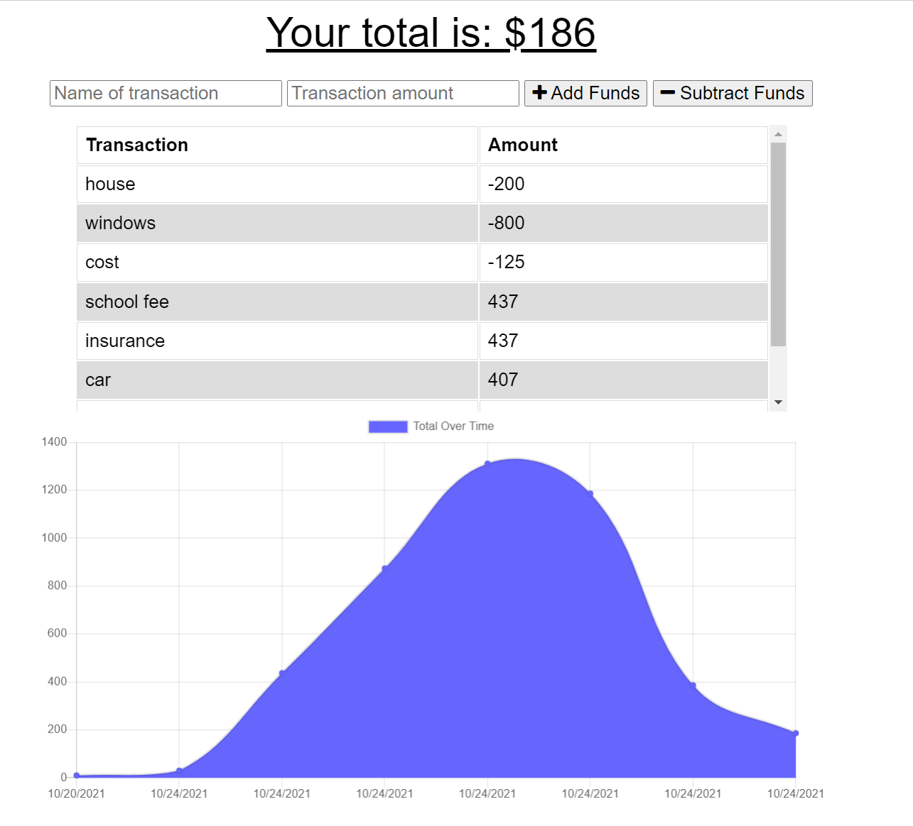

# Budget Tracker

## Description

User Story
AS AN avid traveler

I WANT to be able to track my withdrawals and deposits with or without a data/internet connection
SO THAT my account balance is accurate when I am traveling

Acceptance Criteria

GIVEN a budget tracker without an internet connection
WHEN the user inputs an expense or deposit
THEN they will receive a notification that they have added an expense or deposit
WHEN the user reestablishes an internet connection
THEN the deposits or expenses added while they were offline are added to their transaction history and their totals are updated

## Table of Contents

- [Installation](#installation)
- [Usage](#usage)
- [Contributing](#contributing)
- [Test](#tests)
- [License](#license)
- [Questions](#questions)

## Installation

npm i mongoose, npm i morgan, npm i express,npm start

## Usage

npm i , npm start

## Badges

N/A

## Contributing

N/A

## Tests

npm run test

## License

    This project is license under the MIT license.

If you have any question about license ,please visit to https://opensource.org/licenses/MIT.

## Questions

If you have any questions ,please check the link : https://github.com/billgeng/UT06-2021-BG-Challenge9

If you have any additional questions , please Email to me by billgeng@yahoo.com.
